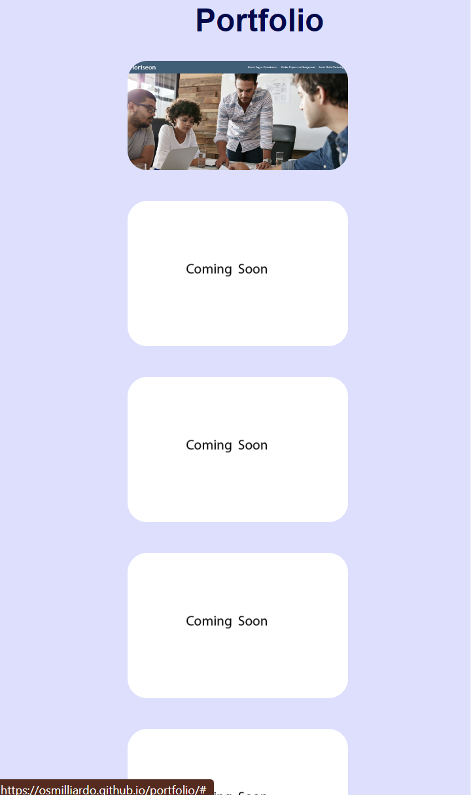

# Portfolio Page 1

## Description

Provide a short description explaining the what, why, and how of your project. Use the following questions as a guide:

This page was made as first real test of my knowledge in the use of HTML and CSS script writing

Although this page was an assignment for the bootcamp, as we were going through the first 2 modules I had intended to make a similar site to showcase my abilities in a sort of resume format, while also linking to pages/projects that I work on in the future

This application has taught a great deal on how to manipulate elements using CSS, as well as the benefit in knowing how to find solutions to styling problems that arise

https://osmilliardo.github.io/portfolio/#

